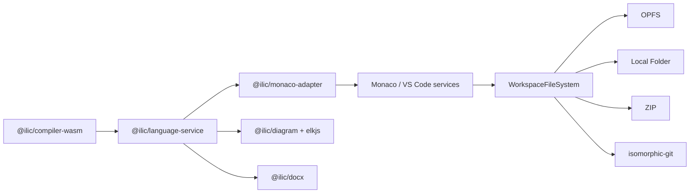

# INTERLIS Web IDE

Offline-first, vollständig clientseitige INTERLIS-IDE für
<https://edigonzales.github.io/interlis-web-ide/>. Monaco und die
VS-Code-Service-Komponenten stellen die Workbench bereit; die gleichen
`@ilic/language-service`-Funktionen laufen ohne REST-Backend oder JSON-RPC direkt
im Browser.

## Funktionen

- INTERLIS-2.3/2.4-Diagnostik, Completion, Navigation, Rename, Formatierung,
  Templates und Compile-Output;
- Explorer, Suche, Outline, Problems/Output, Settings, Command Palette, Tabs,
  Splits, Themes und Statusleiste im VS-Code-Stil;
- semantisches Live-Diagramm mit `elkjs`, Last-Good-Status, Quellnavigation,
  persistenten Einstellungen/Viewport sowie SVG- und DOCX-Export;
- benannte OPFS-Workspaces mit Recovery ungespeicherter Buffer;
- lokaler Ordner in Chromium sowie ZIP-Import/-Export als portabler Fallback;
- lokales Git mit öffentlichem HTTPS-Shallow-Clone, Status, Diff, Branches,
  Stage/Unstage und Commit;
- installierbare PWA und Offline-Start nach dem ersten erfolgreichen Laden.
- transitive Auflösung von `IMPORTS` aus Workspace und Modell-Repositories,
  Repository-Completion sowie Ctrl-Klick in schreibgeschützte Modell-Tabs.

Push, Pull, Fetch nach dem Clone, Authentifizierung, Accounts, Terminal,
Debugger und Extension Marketplace sind bewusst nicht Bestandteil von Version

1. REST-Server und temporäre `.ili`-/Logdateien werden nicht benötigt.

## Architektur



Compiler, Workbench, Recovery und Git sehen dasselbe binäre
`WorkspaceFileSystem`. Die IDE kennt den konkreten Speicheradapter nicht. Siehe
[Browser- und Speicherunterstützung](docs/browser-support.md).

## Entwicklung

Die drei Repositories müssen als Geschwister ausgecheckt sein:

```text
ilic-fork/
interlis-language-tools/
interlis-web-ide/
```

Zuerst werden Compiler-WASM und lokale, geprüfte npm-Tarballs gebaut. Die
Tarballs liegen in ignorierten Artefaktverzeichnissen und werden nie
eingecheckt:

```sh
cd ../ilic-fork
./scripts/build-wasm.sh
cd ../interlis-language-tools
corepack pnpm install --frozen-lockfile
corepack pnpm pack:verify
cd ../interlis-web-ide
corepack pnpm install --no-frozen-lockfile --force --update-checksums
corepack pnpm check
corepack pnpm e2e
```

Die lokalen Overrides verwenden stabile Dateinamen wie
`ilic-language-service-snapshot.tgz`. Die darin enthaltenen Paketmanifeste und
das Lockfile halten trotzdem die vollständigen unveränderlichen Versionen
`0.1.0-SNAPSHOT.<UTC-Zeitstempel>` beziehungsweise
`0.9.9-SNAPSHOT.<UTC-Zeitstempel>` fest. Dadurch erfordert ein neuer
Cross-Repository-Snapshot keine manuelle Pfadanpassung.

Die Web-IDE-Installation verwendet bewusst `--no-frozen-lockfile --force
--update-checksums`: Die lokalen Tarballs werden im vorherigen Schritt neu
erzeugt und können bei gleichem Dateinamen eine andere Prüfsumme haben. GitHub
Actions setzt bei `CI=true` automatisch `frozen-lockfile`; deshalb ist
`--no-frozen-lockfile` im Workflow ausdrücklich nötig. Die aktualisierte
Prüfsumme gilt nur auf dem Runner und wird nicht in das Repository committed.

`pnpm dev` startet die lokale Entwicklung. `pnpm preview` prüft den erzeugten
Pages-/PWA-Build. Node 22 und pnpm 11.14 sind festgelegt.

Die Settings-Ansicht speichert die Repository-Liste dauerhaft. Standard ist
`%ILI_DIR;https://models.interlis.ch`; Workspace-Modelle haben Vorrang. Da die
kanonischen Repository-Server noch kein geeignetes CORS anbieten, werden
`models.interlis.ch` und `models.geo.admin.ch` im Browser vorübergehend auf die
beiden CORS-Mirrors unter `geo.so.ch/models/mirror/` abgebildet. Ein bereits
gefüllter Browser-Cache kann ohne Netzwerk verwendet werden.

Compiler, Language Service und Monaco-Adapter bleiben im Vite-Dev-Modus bewusst
vom Dependency-Prebundling ausgeschlossen: Das generierte Emscripten-Modul löst
sein WASM relativ zu `import.meta.url` auf. Der Production-Build übernimmt die
URL als gehashtes Asset.

## Tests und Veröffentlichung

Vitest prüft Workspace-, Repository- und Git-Verträge. Playwright deckt OPFS,
Recovery, ZIP, Local Folder, Git, den gemeinsamen Language Service, Diagramm,
SVG, DOCX und Offline-Verhalten in Chromium, Firefox und WebKit ab. Der reale
öffentliche SOGIS-Clone läuft zusätzlich wöchentlich und lokal mit:

```sh
corepack pnpm e2e:public-clone --project chromium
```

Die CI prüft Pushes auf `main` mit Build-, Unit- und Browser-Gates. Die
Pages-Pipeline baut Compiler und Language-Tool-Tarballs reproduzierbar neu,
führt `pnpm check` aus und deployed ausschließlich `dist`. Nach einem
koordinierten npm-Release wird sie per `repository_dispatch` mit den exakten
Compiler- und Language-Tools-SHAs gestartet; ein Web-IDE-Push löst keinen
parallelen Pages-Deploy mehr aus. Ein manueller Pages-Trigger bleibt als
nicht release-gepinnter Live-/Recovery-Build mit eigener Snapshot-Zeit und
Run-ID verfügbar. Trigger, Gates, Pinning, lokale Abweichungen, Artefakte,
Berechtigungen und Recovery sind in der
[Build- und Publikationspipeline](docs/build-und-publikationspipeline.md)
beschrieben. Details zu
Browserabweichungen, Local-Folder-Rechten und dem WebKit-Testtreiber stehen in
[docs/browser-support.md](docs/browser-support.md); Sicherheits- und
Datengrenzen in [docs/security-and-privacy.md](docs/security-and-privacy.md).

Die Browser-Gates sind auf zwei Jobs aufgeteilt: `verify` läuft auf Ubuntu und
baut den geprüften Stand, führt `pnpm check` sowie Chromium- und Firefox-E2E
aus. `webkit` läuft anschließend auf `macos-latest`, weil WebKit in unserem
aktuellen Playwright-Setup nur dort zuverlässig funktioniert. Der Job lädt das
von `verify` erzeugte Runtime-Artefakt und testet es mit
`PLAYWRIGHT_PREBUILT=1`; dadurch gibt es keinen zweiten WASM-/Produktionsbuild
und WebKit prüft exakt denselben Stand.

Lizenz: [MIT](LICENSE)
