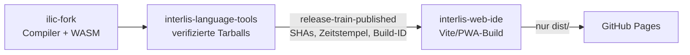

# Build- und Publikationspipeline

[Projektübersicht](../README.md) · [Browser-Unterstützung](browser-support.md) ·
[Sicherheit und Datenschutz](security-and-privacy.md)

Dieses Repository ist das letzte Glied des koordinierten Release-Trains. Es
publiziert keine npm-Pakete, sondern baut die statische, vollständig
clientseitige Web IDE aus drei Quell-Repositories und deployed ausschliesslich
das erzeugte `dist/` nach GitHub Pages.



## Workflows und Trigger

| Workflow                                                                                  | Trigger                                                | Ergebnis                                                                             |
| ----------------------------------------------------------------------------------------- | ------------------------------------------------------ | ------------------------------------------------------------------------------------ |
| [`.github/workflows/ci.yml`](../.github/workflows/ci.yml)                                 | Push auf `main` oder `codex/**`, Pull Request, manuell | Build-, Unit- und Browser-Tests; Runtime- und Testartefakte für 14 Tage              |
| [`.github/workflows/pages.yml`](../.github/workflows/pages.yml)                           | Push auf `main`, `release-train-published`, manuell    | Quellen und lokale Tarballs neu bauen, `pnpm check`, nur `dist/` nach Pages deployen |
| [`.github/workflows/public-clone-smoke.yml`](../.github/workflows/public-clone-smoke.yml) | montags 04:17 UTC, manuell                             | realen öffentlichen HTTPS-Shallow-Clone in Chromium prüfen                           |

Die drei Abläufe haben unterschiedliche Zwecke: CI liefert breite technische
Evidenz, der Pages-Workflow ist der eigentliche Deploy, und der geplante
Public-Clone-Smoke erkennt Änderungen an externem Netz- oder Repository-
Verhalten.

## Quell- und Paketmodell

Alle Workflows verwenden drei Geschwisterverzeichnisse:

```text
ilic-fork/
interlis-language-tools/
interlis-web-ide/
```

Die Web IDE installiert `@ilic/*` nicht über ein bewegtes Registry-Dist-Tag.
`pnpm-workspace.yaml` überschreibt die sechs direkten `@ilic/*`-Abhängigkeiten
mit stabil benannten Tarballs unter
`../interlis-language-tools/artifacts/npm/`. Diese Tarballs enthalten trotzdem
vollständige, unveränderliche Snapshot-Versionen und exakte interne
Abhängigkeiten.

Vor jedem Web-Build werden deshalb zuerst der Compiler-WASM und danach alle
sieben Cross-Repository-Tarballs neu erzeugt. Das macht den Build unabhängig
vom aktuellen Zustand des npm-Tags `snapshot` und prüft genau die ausgewählten
Quellen.

## CI: Build- und Browser-Gates

### Ubuntu-Job `verify`

Der Job läuft mit Node 22 und pnpm 11.14.0. Er checkt den zu prüfenden Web-IDE-
Commit sowie die aktuellen Default-Branches von `interlis-language-tools` und
`ilic-fork` aus.

Die Reihenfolge ist:

1. die in `ilic-fork/.emscripten-version` gepinnte Emscripten-Toolchain
   installieren und `./scripts/build-wasm.sh` ausführen;
2. im Language-Tools-Repository mit eingefrorenem Lockfile installieren und
   `pnpm pack:verify` ausführen;
3. in der Web IDE mit `pnpm install --frozen-lockfile` installieren;
4. `pnpm check` ausführen;
5. `dist/` und die erzeugten npm-Tarballs als
   `interlis-web-ide-runtime-<SHA>` 14 Tage hochladen;
6. Playwright inklusive Chromium und Firefox installieren und beide Projekte
   ausführen;
7. Report und Testresultate auch bei Fehlschlag 14 Tage hochladen.

`pnpm check` ist die blockierende Quell- und Buildprüfung:

```text
lint → TypeScript-Typecheck → Vitest → Vite/PWA-Produktionsbuild
```

Playwright prüft danach den bereits gebauten Browserstand unter anderem für
Workspace, Recovery, ZIP/Local Folder, Git, Compiler- und Language-Service-
Integration, Diagramm, SVG, DOCX und Offline-Verhalten.

### macOS-Job `webkit`

`webkit` beginnt erst nach erfolgreichem Ubuntu-Job. Er lädt dessen
vorproduziertes Runtime-Artefakt herunter, installiert die Web-IDE-
Abhängigkeiten und nur den WebKit-Browser. Mit `PLAYWRIGHT_PREBUILT=1` verwendet
Playwright den bereits geprüften `dist/`-Build, statt ihn auf macOS erneut zu
erzeugen. WebKit-Reports werden ebenfalls unabhängig vom Testergebnis 14 Tage
aufbewahrt.

Ein grüner CI-Lauf deployed nichts. Er ist von der Pages-Pipeline getrennt.

## Koordinierter Pages-Deploy

Der normale produktive Weg beginnt nach einem erfolgreichen npm-Release in
`ilic-fork` und anschliessender Publikation der fünf Language-Pakete in
`interlis-language-tools`. Dessen Publish-Workflow sendet erst danach ein
`repository_dispatch` vom Typ
`release-train-published` mit:

```json
{
  "compiler_sha": "<vollständiger SHA>",
  "language_tools_sha": "<vollständiger SHA>",
  "compiler_version": "0.9.9-SNAPSHOT....",
  "language_tools_version": "0.1.0-SNAPSHOT....",
  "compiler_timestamp": "YYYYMMDDHHmmss",
  "compiler_build_id": "<Compiler-Publish-Run-ID>",
  "language_timestamp": "YYYYMMDDHHmmss",
  "language_build_id": "<Language-Publish-Run-ID>",
  "release_run_id": "<GitHub-Run-ID>"
}
```

Bei diesem Ereignis checkt der Pages-Workflow exakt `compiler_sha` und
`language_tools_sha` aus und prüft beide SHAs nach dem Checkout erneut. Für die
Rekonstruktion werden `language_timestamp`, `language_build_id` und
`compiler_version` an `pnpm pack:verify` übergeben, sodass die lokal neu
erzeugten Tarballs dieselben Paketversionen wie der koordinierte npm-Release
tragen.

Die beiden Versionsfelder und `release_run_id` dienen der Nachverfolgbarkeit
des Ereignisses. Compiler- und Language-Build-ID bleiben getrennt.

### Build-Job

Der Pages-Build wiederholt bewusst die auslieferungsrelevanten Schritte:

1. Compiler-WASM aus dem ausgewählten Compiler-SHA bauen;
2. sieben Tarballs aus dem ausgewählten Language-Tools-SHA mit der exakten
   Compiler-Version und der separaten Language-Zeit-/Build-ID bauen und als
   Consumer prüfen;
3. Web-IDE-Abhängigkeiten mit `pnpm install --force --update-checksums`
   installieren;
4. mit `pnpm check` linten, typprüfen, Unit-Tests ausführen und den
   Produktionsbuild erzeugen;
5. GitHub Pages konfigurieren und nur `interlis-web-ide/dist` als
   Pages-Artefakt hochladen.

`--update-checksums` ist erforderlich, weil die lokalen Tarball-Dateinamen
stabil bleiben, ihr Inhalt bei jedem koordinierten Snapshot aber eine neue
Version und Prüfsumme besitzt. Es ändert das eingecheckte Lockfile auf dem
Runner, nicht im Repository.

Der Pages-Workflow führt keine Playwright-Suite aus. Diese Browser-Evidenz
kommt aus CI; der Deploy selbst wird durch die schnelleren `pnpm check`-Gates
geschützt.

### Deploy-Job

Nur nach erfolgreichem Build übernimmt `actions/deploy-pages` das hochgeladene
`dist/`. Der Job läuft im geschützten GitHub-Environment `github-pages`; dessen
URL wird als Deployment-URL gesetzt.

Die Concurrency-Gruppe `pages` hat `cancel-in-progress: true`. Trifft während
eines laufenden Deploys ein neuer Pages-Trigger ein, wird der ältere Lauf
abgebrochen und nur der jüngste fortgesetzt. Das verhindert, dass ein älterer
Build nach einem neueren live geht.

## Direkter `main`- und manueller Pages-Build

Ein Push auf den Web-IDE-Branch `main` startet weiterhin direkt einen
Pages-Build. Ein manueller Start ist ebenfalls möglich. Bei beiden Wegen
werden die `main`-Stände von Compiler und Language Tools verwendet; es gibt
keinen koordinierten Payload mit einer bereits publizierten Quellpaarung.

Bei einem Push oder manuellen Start existiert kein Release-Payload. Der
Workflow erzeugt deshalb eine eigene UTC-Zeit und verwendet die aktuelle
Workflow-Run-ID. Compiler- und Language-Tools-SHA werden nach dem Checkout
festgehalten; es entsteht bewusst ein Live-/Entwicklungsbuild und kein Nachweis
für ein bereits publiziertes npm-Manifest. Leere Event-Felder werden nicht mehr
als Snapshot-Werte an `pack:verify` weitergereicht.

Nur `release-train-published` ist ein reproduzierbarer Release-Build: Dort sind
beide SHAs und die exakten Versionen im Payload gepinnt.

## Pinning und lokale Abweichungen

Der produktive Pages-Build pinnt zuerst beide Quell-SHAs aus dem Dispatch und
prüft sie nach dem Checkout erneut. Danach werden Compiler-WASM und lokale
Tarballs genau aus diesen Quellen gebaut. `pnpm-workspace.yaml` verweist dabei
absichtlich auf lokale Tarballs statt auf den beweglichen npm-Tag `snapshot`.
Die Runner-Installation mit `--update-checksums` verändert nur den temporären
Lockfile-Zustand des Runners.

Lokal kann derselbe Build deshalb ohne OIDC, GitHub-Payload oder npm-Publikation
funktionieren: Die drei Geschwister-Repositories und die lokalen Tarballs sind
direkt verfügbar. Ein lokaler Erfolg beweist weder, dass der Release-Payload
vollständig ist, noch dass npm den Trusted Publisher des jeweils publizierenden
Repositories akzeptiert.

## Wöchentlicher Public-Clone-Smoke

`Public clone smoke` baut Compiler und Tarballs ebenfalls frisch, installiert
die Web IDE mit eingefrorenem Lockfile und führt gezielt
`pnpm e2e:public-clone --project chromium` aus. Der Test greift absichtlich auf
ein reales öffentliches Repository zu und bleibt deshalb ausserhalb der
deterministischen CI- und Release-Gates.

Bei Erfolg wird kein Artefakt erzeugt. Bei Fehlschlag lädt der Workflow die
Playwright-Testresultate hoch, damit Netzwerk-, CORS- oder Clone-Probleme
diagnostiziert werden können.

## Publikationsgrenzen und Berechtigungen

Der Pages-Workflow besitzt:

```yaml
permissions:
  contents: read
  pages: write
  id-token: write
```

`pages: write` und der kurzlebige OIDC-Token sind nur für GitHub Pages nötig.
Im Web-IDE-Repository gibt es für diesen Ablauf kein npm-, Marketplace- oder
manuelles Deploy-Secret. Das Web-IDE-Repository empfängt lediglich den
`release-train-published`-Dispatch. Das Secret `RELEASE_DISPATCH_TOKEN` liegt
im vorgelagerten `interlis-language-tools`-Repository und wird dort als
GitHub-API-Token für den Dispatch gespeichert. Es ist kein npm-Token und wird
hier nicht benötigt; GitHub Pages verwendet die in diesem Workflow deklarierte
`pages: write`-/OIDC-Berechtigung.

Publiziert wird ausschliesslich der statische Inhalt von `dist/`. Nicht
publiziert werden:

- npm-Pakete oder npm-Dist-Tags;
- die lokalen Tarballs;
- Quellcode oder Lockfile-Änderungen vom Runner;
- Testreports als Teil der Website;
- ein Server, Container, natives Binary oder GitHub Release.

## Lokal dieselben Schritte ausführen

Nach Aktivierung der in `ilic-fork/.emscripten-version` festgelegten
Emscripten-Version:

```sh
cd ../ilic-fork
./scripts/build-wasm.sh

cd ../interlis-language-tools
corepack pnpm install --frozen-lockfile
corepack pnpm pack:verify

cd ../interlis-web-ide
corepack pnpm install --force --update-checksums
corepack pnpm check
corepack pnpm e2e
corepack pnpm preview
```

Für eine exakte koordinierte Tarball-Version vor `pack:verify` setzen:

```sh
export SNAPSHOT_TIMESTAMP=20260721120000
export SNAPSHOT_BUILD_ID=123456789
```

Der lokale Public-Clone-Smoke bleibt explizit opt-in:

```sh
corepack pnpm e2e:public-clone --project chromium
```

## Fehlerbehandlung und Nachweis

- Scheitert der Build-Job, wird kein Pages-Artefakt deployed.
- Bei einem direkten Push oder manuellen Lauf zuerst die bekannte leere
  `SNAPSHOT_TIMESTAMP`-Übergabe berücksichtigen; dieser Pfad ist derzeit nicht
  releasefähig.
- Scheitert nur der Deploy-Job, bleibt der vorherige Pages-Stand online; der
  verifizierte Build kann anhand des Action-Laufs untersucht werden.
- Bei falschen oder nicht erreichbaren SHAs schlägt bereits der Checkout fehl.
- Bei abweichendem Tarball-Inhalt erkennt die Installation aktualisierte
  Prüfsummen; `pack:verify` prüft zusätzlich Versionen und exakte interne
  Abhängigkeiten.
- Ein neuer Pages-Lauf kann einen älteren absichtlich abbrechen. Bei scheinbar
  verschwundenen Läufen deshalb zuerst die Concurrency-Historie prüfen.
- Der Upstream-Release ist durch `release-manifest.json` im
  `interlis-language-tools`-Artefakt `interlis-release-<run-id>` nachvollziehbar.
- Ein fehlgeschlagener Pages-Deploy macht bereits publizierte npm-Pakete nicht
  rückgängig. Nach der Fehlerbehebung wird der koordinierte Dispatch oder der
  Pages-Workflow erneut gestartet.

Die vorgelagerte Paketpublikation ist im
[Language-Tools-Repository](https://github.com/edigonzales/interlis-language-tools/blob/main/docs/build-und-publikationspipeline.md)
dokumentiert; die Compiler-CI im
[Compiler-Repository](https://github.com/edigonzales/ilic-fork/blob/main/docs/build-und-publikationspipeline.md).
